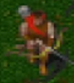
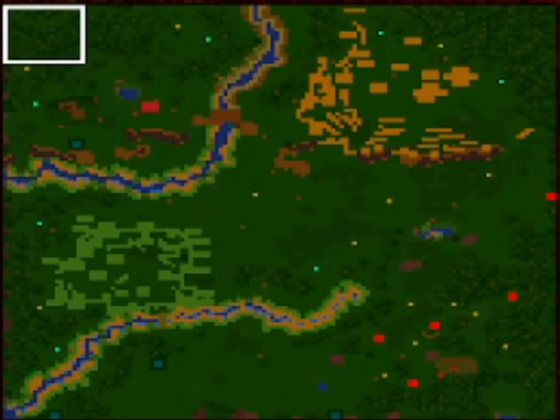
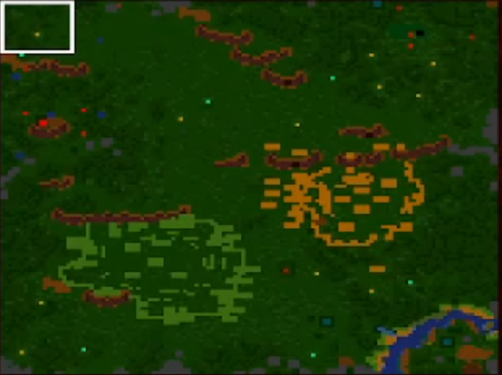
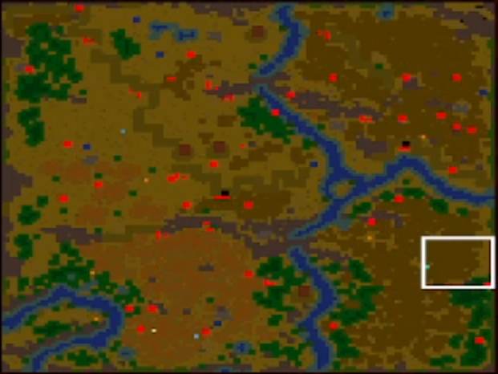

# Horde2


Horde: The Northern Wind  
Horde II: The Citadel  

Published by: 	Buka Entertainment  
Developed by: 	7th BitLabs  

Git-wiki page

**Horde: The Northern Wind**, is a real-time strategy game that is very similar to Warcraft II. It is set in the world of Semirechye (Russian for "Land of the Seven Rivers"), a medieval fantasy setting loosely based on Slavic folk tales. The player, who takes on the role of a tribe leader, must build up settlements, explore and interact with his neighbours, and eventually uncover the main plot of the game. Unlike other RTS games, there are no missions; the world is divided into 9 large maps (in a 3x3 pattern) and the player's units can traverse between them at any time, given that the path between the two adjacent maps is not obstructed. Once the player's alter ego leader unit moves into a new map, control of the settlement and all remaining units in the previous map is relegated to the AI. There is a vague global goal of slaying the dragon, but as the game progresses, the player has to figure out how to find said dragon and deal with it, introducing a non-linear element to the gameplay.   

**Horde: The Citadel** is a sequel to the fantasy real-time strategy game, Horde: The Northern Wind. Continuing the story of the land of Semirechye, The Citadel further explores the conflict between the Semireks and the invading nomads lead by their khan Teimur. In The Northern Wind, Semirek leaders have been able to drive Teimur's forces out of Lower Urgal, however the khan had been able to ally with hermit wizards and fortify his lands. The only path to his main citadel, Vorezh, lies through the Land of Shadows no man dares to tread, and the Semireks will need to secure an alliance with the dreaded dragons to pass safely into Teimur's domain.

The Citadel essentially uses the same engine as its predecessor, retaining all of the original game mechanics but also adds new content in the form of units, structures, items and terrain types. The game runs in higher resolution as The Northern Wind, but the sprites are not scaled up so a larger portion of the battlefield is visible. Gameplay remains mostly the same, with the player having to explore each of the nine maps in order to solve the main quest, find necessary items, defeat or negotiate with opponents. The maps are also larger, and each usually has two neutral Semirek settlements for the player to interact with, while in the previous game, only one settlement was initially present on most maps.

Most of the new units introduced in The Citadel have the ability to use two attacks, melee and ranged, something which was not possible in the original game. Additionally, the player can produce air units - pigeons - to quickly scout the map. New monsters had been introduced as well, such as dragons, crocodiles, scorpions, were-bears and magic riders. The game re-uses portraits of non-player Semirek leaders from The Northern Wind, but with different names; key plot-related characters however have new portraits and, in some cases, new sprites to represent them on the map.

There is an option to import characters from The Northern Wind into The Citadel, so that all items and units that were present with the character when the first game was won will be carried over into the sequel


[archive.org](https://archive.org/details/horde_demo)  
[mobygames.com](https://www.mobygames.com/game/59127/horde-the-citadel/)  
[gamesnostalgia.com](https://gamesnostalgia.com/game/horde-the-citadel)


# Buildings 

## Castle


Castle and Stone Castle are built from the hero menu only 1 can be built per map.  

## Quarry  
   
Resource gathering buildins - gold, steel
## Lumbermill  
   
Resource gathering buildins - wood
## Farm  
   
Resource gathering buildins - population, taxes
## Barracks  
   
## Factory  
   
## Laboratory  
   
## Stables  
   
## Mill  
   
speeds up unit production
## Church  
   
final building before stone age

## Stone age barracks  
   





## Stone age factory  
   


## Stone age laboratory  
   
## Stone age mill  
   
Greatly speeds up unit production
## Stone age stables  
  


## Aviary  
   


  
## Special units


# Items

# Maps

## Map 1
  

Starting character: Oleg  
Enemies: vseslav, bogdanan  
Access to: 2,1-2  
Mage: Chanas  
Notes:   
- If you hold the bluegem, earth will rise to allow access to 1-2 map
- Secret parchment in the cave
- Mage drops staff

## Map 2
  
Starting  character: Igor  
Enemies: Bogomil, Svetogor  
Access  to: 1,3, 2-2(via snake map)  
Mage: Ikon  
Notes:
- Shado  sword to kill enemies on 2-3 map  
- Secre  parchment in the cave   
- Made  rops lighning spectres  

## Map 3
  
Starting character: Eric        
Enemies: Lazar, Radion
Access to: 2,3-2, snake map     
Mage: Dorin      
Notes:
- If you hold the bluegem, earth will rise to allow access to secret snake map      
- Secret parchment in the cave      

## Map 3-2
   
Enemies: Nikodin, Belozer           
Mage: Kogan      
Access to: 3-3, 2-2     
Notes:      
- Will allow access to 2-2 dragon map though the hills      

## Map 3-3
   
Enemies: Ruslan, Dunaj     
Mage: olga  
Access to: 2-2      
Notes: 
- Olga is one one the main objectives and hold half of the dragon crown     

## Map 2-2
   
Enemies: Dragon     
Access to: 3-2,1-2,2-3,2(only to snake island)      
Notes:  
- Gives lighning item used to summon dragons    
- Can not return without crown or will get dragon aggro 
- 3 spiderwebs on the left side, contains dragon killer, diamond, green lighning(clears hero xp)    


## Map 1-2 
   
Enemies: Zimagor, Polkan      
Access to: 1,1-3, 2-2       
Made: Dagon     
Notes:      
- Dagon Will drop 2 poisons    
- Arguable hardest enemies out of all due to many stone towers, use dragons here if you have them       
- Mage keeps summoning spectres acound the map defend everything        


## Map 1-3
   
Enemies: Jermak, Jerofei       
access to 1-2       
Mage: Vilur     
Notes:      
- Vilur is one of the main objectives and hold the other half of the dragons crown      


## Map 1-3
   
Enemies: 
access to 2-2       
- you need to wear the crown of the dragon to disable clouds and aligators, you can only equip the crown while in this map


## Snake map
  
Notes:
- Contains 2 poisons
- Urn of spectres(botom left)
- Gold 
- Spectres


## Map 2-4
  
final map, walking to the bridge triggers the cutscene


# Cheats
Code          |     Effect
-|-
CTRL+SHIFT+ALT+M | Gives You The Ability To See Everything On The Map!
Ctrl+Shift+Alt+R | Sets your resources to 100,000 and Population to 500!
Ctrl+Shift+Alt+H | Heals The Troops/Workers That Are Selected (Not Buildings)


# technical links

## ddraw
Fixed the avi/cinematic errors, does not fix random game crashes. Copy ddraw.dll to game directory, launch game, if log file in the game directory was created - dll is working. Use ini or internal settings to intereact with advanced graphics settings

[ddraw github](https://github.com/narzoul/DDrawCompat)  
ddraw.dll  
DDrawCompatOverlay-horde2.ini   
```ini
DisplayAspectRatio = 16:9
```

# Contributions
All controbutions are welcome, if you have any information about the game, please share it with us

# TODO
- [ ] finish tech tree
- [ ] add hero items
- [ ] get better maps
